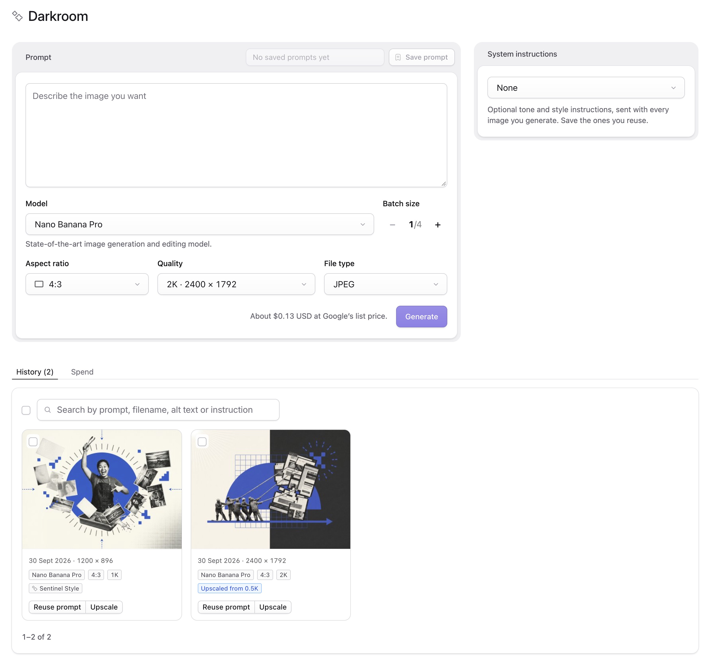

# Darkroom

Generate images with Google's Nano Banana models from the Statamic Control Panel and save them straight into your asset library.

Darkroom uses your own Google API key. You write a prompt, pick a model, aspect ratio and quality, preview what comes back, and save the ones you want into any folder as normal Statamic assets.




## Requirements

- Statamic 6
- PHP 8.3 or later
- A Google Gemini API key on a project with billing enabled. Google's image models have no free tier.

## Installation

```bash
composer require d3creative/statamic-darkroom
```

Add your key to `.env`:

```
GEMINI_API_KEY=your-key-here
```

Darkroom then appears in the Control Panel sidebar under **Tools → Addons**, alongside your other addons. Users who cannot configure addons do not have that menu, so for them it appears directly under **Tools**.

The key is only ever read on the server. It is never sent to the browser.

## Permissions

Super users can use Darkroom straight away. Everyone else needs two permissions:

- **Generate images with Darkroom** (`use darkroom`)
- Permission to upload to at least one asset container

Only containers a user may upload to are offered as destinations.

The **Spend** tab shows each user only the images they generated. To let someone see everyone's, give them **See everyone's spend in Darkroom** (`view all darkroom spend`). Super users always see everyone's.

## Using it

| Control | What it does |
|---|---|
| Model | Nano Banana Pro, Nano Banana 2 or Nano Banana 2 Lite, with Google's description of the chosen one shown below the menu |
| Aspect ratio | Auto, 1:1, 3:4, 4:3, 2:3, 3:2, 9:16, 16:9, 5:4, 4:5 or 21:9. Auto lets the model choose |
| Quality | 1K, 2K or 4K, with the pixel size shown where it is known. Nano Banana 2 also offers 0.5K. Lite produces 1K only, a limit of the model: Google refuses larger sizes for it |
| File type | JPEG, WebP or PNG |
| Batch size | 1 to 4 images from the same prompt. Always starts at 1 |

The estimated cost is shown next to the Generate button before you spend anything.

Generated images are held in temporary storage and shown as previews. For each one you can set the filename, alt text and file type, then **Save to folder…** or **Discard**. Filenames are made URL-safe as you type or paste: lowercase, with spaces and punctuation turned into hyphens. Nothing reaches your asset library until you save it. If you reload the page, unsaved images are still there.

### Choosing where to save

**Save to folder…** opens Statamic's own asset browser in a panel, laid out like the drawer core uses when you pick an asset: the same search, folders, breadcrumbs and **Create Folder** as the Assets section. Go to the folder you want, or create one, then **Save here**. Core's search matches files only, so as you type, any folders whose names match are also offered above the results, including one you created a moment ago that is still empty; click one to go straight into it. **Save all** on a batch asks once and saves every unsaved image in it to the same place. The browser opens on wherever you saved last.

### Alt text

**Write** next to the alt text box asks one of Google's text models to describe the image, using the same API key. It sees the image and the prompt that made it, and replies with one plain sentence in British English, under 125 characters, including any words in the image that matter. It takes a few seconds and costs a few hundredths of a cent. Edit the suggestion before saving if it needs it; **Rewrite** asks again.

The model is `gemini-3.5-flash-lite` by default. Change `alt_text.model` to use another.

### Drafting small, then upscaling

Drafts can be small. Nano Banana 2 at 0.5K costs $0.045, a third less than its 1K, and a 16:9 image comes back at 688 × 384. When one is worth keeping, **Upscale** sends it back to the model and asks for the same image at a larger size. Upscale is on every unsaved image and on every image in History, so you can also enlarge something you saved earlier.

You choose the model and the target size, with the pixel size and the cost shown for each. The result appears as a new image to preview and save; the one it came from is left alone.

Two things to know:

- **It is a redraw, not an enlargement.** The composition, subject and colours hold, but fine detail can shift, small lettering in particular. In testing, Nano Banana Pro kept text and detail intact where Nano Banana 2 altered some of it, so Pro is suggested by default.
- **0.5K is only offered on Nano Banana 2.** Pro and Lite accept the size but bill it as a 1K image and were no faster at it, so they offer 1K and up. At $0.0336 for 1K, Lite is the cheapest draft of all.

The system instruction is not sent with an upscale. The image already carries the style.

### Revising with notes

When an image is nearly right, **Revise** lets you say what to change and where, and keep refining it round by round. It is on every unsaved image and on every image in History.

The Revise panel shows the image you are working on next to a feed of every round so far. Click the image to pin a numbered note to a spot and write what to change there: "remove this door" on the door, "add a cityscape here" on an empty patch of background. Add as many as ten. The **Message** box is for anything else: changes to the whole image, such as "warmer light", or notes about earlier rounds, such as "undo that". Choose the model and size, with the price shown, and send it.

Each round appears in the feed with your notes and the image that came back, and the panel moves on to it when it is ready, so you can keep going. Any round can be the starting point for the next: click **Revise from this** to go back to an earlier one, which is the way to undo a round that went wrong. Rounds that started somewhere other than the round before them say so ("from round 1"). Save any round from the feed, or from its card on the page.

Rounds remember each other. The model sees the earlier rounds of the thread, so a note can refer back to them, and the feed marks a round **Remembered earlier rounds**. To do this, Google keeps each revision round (the image, your notes and what came back) for your project's retention period, up to 55 days, and it is visible in Google AI Studio's logs. Set `DARKROOM_REVISION_MEMORY=false` to keep nothing on Google's side; each round then stands alone, sending the image with its notes. Remembering costs the same as not: only the latest image is billed as input. New images and upscales are never kept. When a conversation is too old or has gone, or a saved image has been cropped or replaced since, the round simply starts fresh from the image, and the feed says so.

The working area shows one card per revision thread: its latest round, with **Revisions (n)** to reopen the feed. Once you save that round, the thread moves to History with it. A saved round keeps the original prompt and style and the line of rounds that led to it, so opening Revise on it from History brings the feed back, even after its unsaved rounds have been cleared away.

Like upscaling, each round is a redraw, so expect small differences elsewhere, and the model may tidy up things that belonged to what you removed, such as an arrow pointing at it. If something must stay, say so in a note. Nano Banana Pro is the most faithful. The system instruction is not sent; the image already carries the style.

### How a revised image was made

When you save a revised round, the original and every round that led to it are saved too, at full size, in a `revisions` folder beside it: save `darkroom/kite.jpg` and you also get `darkroom/revisions/kite-original.jpg`, `kite-round-1.jpg` and so on. An original that was already in your asset library, or a round you saved as an image of its own, is not copied; it is used where it is. Rounds shared by two saved images are saved once. Rounds you never saved still go after 24 hours. The folder picker tells you before you save.

In History, click a revised image, or its **Revisions (n)** button, to see its story, newest first: the image you saved and the notes that produced it, pinned on the image they were written on, then each earlier round the same way, down to the original and its prompt. From there you can open it in the asset editor, carry on revising it, or delete its revision history. Anyone who can view the image can see its story; an earlier image in a container they cannot view is shown as hidden. Moving or renaming any of these images does not break it: they are found by the data stored on them, not by their paths.

**Delete revision history** deletes the earlier images kept for it and the notes from each round. The image stays where it is, and stays in History. An earlier image that another saved image's story still shows, or that is used on a page, is kept, and you are told which. It needs permission to edit the image, and earlier images you may not delete are kept too.

Deleting a revised image, from Darkroom's Trash or anywhere else in Statamic, deletes the earlier images kept for it in the same way. If the image you delete is itself an earlier step of another saved image, a copy is kept in that image's `revisions` folder first, so its story stays whole.

The earlier images are ordinary assets. They show in the asset browser and in asset fields, are public at the container's URL like any other asset, and are committed to Git if your site tracks its assets. Each one is the size of the image it shows: 2 to 2.5 MB at 2K, and around 9 MB at 4K. Set `DARKROOM_SAVE_REVISION_HISTORY=false` to keep none of them; stories then show the notes, and say the images were not kept. Images you revised and saved before this was added have their earlier steps saved once, the first time Darkroom is opened, if those rounds are still in temporary storage.

### History

Once an image is saved it moves to the **History** tab: every image Darkroom has saved, newest first, with the date it was made, its size, and the model, aspect ratio and quality that made it. **Reuse prompt** puts the prompt and all of those settings back into the form. The search box finds images by any word in the prompt, filename, alt text or system instruction, so a folder name finds everything saved in it. It pages like the Assets listing, with the same **Per Page** menu, and remembers your choice as a user preference. Clicking an image opens Statamic's own asset editor over the page, so you can change alt text, set a focal point, crop or rename it without leaving Darkroom. Clicking a revised image shows [how it was made](#how-a-revised-image-was-made) instead, with a button to open the editor.

The history is not a separate log. The prompt and settings are stored on the asset itself, under a `darkroom` key in its metadata. So the history follows your assets wherever they are synced, editing an asset later keeps it, and deleting an asset removes it from the list. You only see images from containers you are allowed to view.

### Trash

Tick images in History, using the checkbox on each card or **Select all on this page**, then **Move to Trash**. A **Trash** tab appears while it has anything in it, listing what was removed, when, and when it will be deleted.

Moving an image to Trash does not touch the asset. It stays in your asset library, at the same path, and keeps working wherever it is used, until it is deleted 30 days later. From the Trash tab you can **Restore** images to History, or **Delete forever** straight away.

Before anything is moved or deleted, Darkroom checks whether the image is used on the site: in an Assets, Bard or Link field of any entry, term, global or user. If it is, you are told where, and when moving to Trash you can choose **Keep in asset library** instead: the asset stays in use and Darkroom just stops listing it. The 30-day clean-up never deletes an image that is still in use; it does the same and forgets it. Deleting a used image by hand asks first, listing the pages that will be missing it. Images written into templates or linked from other sites cannot be detected.

Moving to Trash needs permission to delete assets in that container, because that is where Trash leads. Restoring needs permission to edit them.

### Spend

The **Spend** tab shows an estimated total for each month, broken down by model, with a list of every image behind it and its prompt. Alt text calls are included in the total and listed separately.

Each user sees only their own images, unless they have the permission to see everyone's (see [Permissions](#permissions)). Images made with `darkroom:smoke` belong to no user, so only people who can see everyone's spend see those.

Google charges when an image is generated, so every image it returns is counted, including upscales and ones you went on to discard. Images that failed are not counted. Each is recorded at the list price in your config at the time.

These are estimates in US dollars. Your Google invoice is the real figure: it also counts the small number of text tokens in each request, and prices can change before the config is updated.

### System instructions

Tone and style notes that are sent along with every image, such as a house illustration style or a colour palette. Save as many as you like, give each a title, and mark one as the default to have it selected whenever the page loads.

Nano Banana Pro and Nano Banana 2 honour system instructions directly. Nano Banana 2 Lite ignores them, so for that model Darkroom places the instruction at the start of the prompt instead. The page tells you when this applies.

### Saved prompts

Save a prompt together with its model, aspect ratio, quality, file type, folder and system instruction, then load it again later. Batch size is never saved with a prompt, so loading one cannot multiply what the next click costs.

Saved prompts and system instructions are stored as YAML in `resources/addons/statamic-darkroom/`, so they can be committed with the rest of your site.

## What gets saved

- **Full size.** Images are stored at the size they were generated. A container's source preset (for example a 2000px cap on uploads) is not applied to them. Set `save.apply_source_preset` to `true` to change that.
- **JPEG is untouched.** Google returns JPEG. Saving as JPEG keeps those exact bytes with no re-compression. WebP and PNG are converted on your server. A PNG is a lossless copy of Google's JPEG, so it adds no detail and is several times the size; choose it when something needs the format.
- **Like any other upload.** Saving goes through Statamic's own upload path, so filenames are made safe, a name that is already taken gets a suffix instead of overwriting, the usual asset events fire and Glide presets are warmed.
- **And the steps before it.** Saving a revised image also saves the images that led to it, in a `revisions` folder beside it (see [How a revised image was made](#how-a-revised-image-was-made)). Those are written straight into the container, so no Glide presets are made for them.

Full-size sources are large. A 4K JPEG is around 9 MB.

## Prices

Google bills per image, in US dollars. These are the list prices Darkroom ships with, correct on 30 September 2026. Check [Google's pricing page](https://ai.google.dev/gemini-api/docs/pricing) and update the config if they change.

| Model | 0.5K | 1K | 2K | 4K |
|---|---|---|---|---|
| Nano Banana Pro | not offered | $0.134 | $0.134 | $0.24 |
| Nano Banana 2 | $0.045 | $0.0672 | $0.101 | $0.151 |
| Nano Banana 2 Lite | not offered | $0.0336 | not available | not available |

A batch costs the price of one image multiplied by the batch size. An upscale costs the price of one image at the size you upscale to. The figure shown in the Control Panel is an estimate from these numbers, not a bill.

## Configuration

Publish the config file to change anything:

```bash
php artisan vendor:publish --tag=statamic-darkroom-config
```

| Key | Default | Purpose |
|---|---|---|
| `api_key` | `GEMINI_API_KEY` | Your Google API key |
| `default_model` | `gemini-3-pro-image` | The model selected on first visit. Also `DARKROOM_MODEL` |
| `models` | three models | Each model's label, description, qualities with prices, aspect ratios and how it takes a system instruction. Add or retire a model here |
| `batch.max` | `4` | Largest batch allowed |
| `defaults` | 16:9, 2K, JPEG | What the form starts with, including a default container and folder |
| `file_types` | JPEG, WebP, PNG | The file types offered when saving |
| `encode.quality` | `90` | Compression used when converting to WebP |
| `save.apply_source_preset` | `false` | Run the container's source preset on saved images |
| `temp.retention_hours` | `24` | How long unsaved images are kept |
| `trash.retention_days` | `30` | How long images wait in Trash before they are deleted |
| `revise.remember` | `true` | Let revision rounds remember earlier rounds, which keeps them on Google's side for up to 55 days. Also `DARKROOM_REVISION_MEMORY` |
| `revise.remember_days` | `50` | Conversations older than this start fresh instead of being carried on |
| `revise.history.save` | `true` | Save the original and earlier rounds of a revised image beside it when it is saved. Also `DARKROOM_SAVE_REVISION_HISTORY` |
| `revise.history.folder` | `revisions` | The folder they are saved in, inside the saved image's folder |
| `upscale.prompt` | see config | The instruction sent with an image when upscaling it |
| `alt_text.model` | `gemini-3.5-flash-lite` | The text model that writes alt text. Also `DARKROOM_ALT_TEXT_MODEL` |
| `alt_text.prompt` | see config | What that model is asked to write |
| `api` | `interactions` | Which Google endpoint to use. `generate_content` is the older one, kept as a fallback. Also `DARKROOM_API` |

## How generation runs

An image takes anywhere from five seconds to a minute, which is too long for a normal page request. Darkroom answers the request immediately, generates after the response has been sent, and the page checks back every couple of seconds. This needs no queue worker.

If Google is overloaded or rate limited, each image is tried up to three times. A rejected request, a bad key or a blocked prompt is not retried, and the reason is shown on the image's card.

Saving works the same way, because warming Glide presets from a large source can take a while.

Unsaved images live in `storage/app/statamic-darkroom/batches/`, outside the web root, and are private to the user who generated them. Anything older than the retention period is removed whenever the page is opened, and daily by `darkroom:prune` if your site runs Laravel's scheduler.

The spend log is kept separately in `storage/app/statamic-darkroom/usage/`, one file per month, and is never pruned. It is not in Git, so each environment keeps its own.

## Commands

```bash
# Generate one real image to check your key and connection. This costs money.
php artisan darkroom:smoke "a red bicycle" --model=gemini-3.1-flash-lite-image

# Remove unsaved images older than the retention period, and delete anything
# in Trash for longer than 30 days that is not used on the site.
php artisan darkroom:prune
```

## Good to know

- Google's documentation states that every generated image carries an invisible SynthID watermark. It cannot be turned off.
- Your prompts and images are handled under Google's Gemini API terms, not by D3 Creative. Nothing is sent anywhere else.
- Revision rounds are kept by Google for up to 55 days so later rounds can remember them (see [Revising with notes](#revising-with-notes)). Set `DARKROOM_REVISION_MEMORY=false` to keep nothing there. New images and upscales are never kept.
- Apart from upscaling and revising an image Darkroom made, generating from a reference image is not supported yet.
- Statamic keeps each asset's data, including Darkroom's prompts and revision notes, in `.meta` folders on the container's disk. If a container lives in your public folder, your web server may serve those files to anyone who guesses the address, as Laravel Herd does. Many production setups already block paths starting with a dot; if yours does not, add a rule such as nginx's `location ~ /\.(?!well-known) { deny all; }`.

## Uninstalling

```bash
composer remove d3creative/statamic-darkroom
rm -rf public/vendor/statamic-darkroom
```

The first command removes Darkroom from the Control Panel, along with its routes, permission and daily prune. The second deletes the Control Panel scripts and styles that were copied into `public/` on install, which Composer does not remove.

Darkroom leaves everything it made in place, so you choose what to keep:

| What | Where | Keep it if |
|---|---|---|
| Saved prompts and system instructions | `resources/addons/statamic-darkroom/` | You might reinstall. Darkroom picks them up again |
| Spend log | `storage/app/statamic-darkroom/usage/` | You want a record of past spend. Everything else under `storage/app/statamic-darkroom/` is unsaved images and test output, and can go |
| Config | `config/statamic-darkroom.php` | Only there if you published it |
| API key | `GEMINI_API_KEY` in `.env`, plus any `DARKROOM_` variables | Something else uses the key |
| Permission | `use darkroom` in `resources/users/roles.yaml` | Only there if you gave it to a role. It does nothing once Darkroom is gone |

Images you saved stay in your asset library as ordinary assets, including any in Trash, which are no longer deleted once Darkroom is gone. Each one keeps a `darkroom` entry in its metadata with the prompt and settings that made it. Nothing reads it without Darkroom, and if you reinstall, they appear in History or Trash again.

The same goes for the `revisions` folders beside revised images: they stay as ordinary assets, and you can delete them like any other folder. Their images carry a `darkroom_revision` entry, and an image that a revision started from carries `darkroom_origin`.

## Support

Report bugs and ask questions on [GitHub Issues](https://github.com/d3creativeuk/statamic-darkroom/issues). Darkroom is maintained by [D3 Creative](https://d3creative.uk).

## Licence

MIT. Built by [D3 Creative](https://d3creative.uk).
